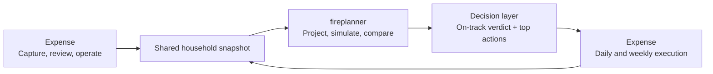
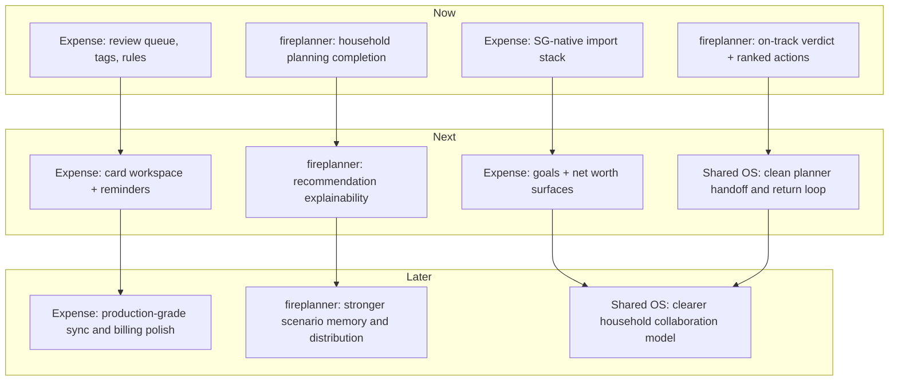

# Personal / Household Financial OS

Updated: 2026-03-12

## Working Model

Treat the combined product as one local-first personal and household financial OS:

- `Expense` is the daily operating layer.
- `fireplanner` is the long-horizon planning and decision layer.
- The shared OS loop is: `capture -> clean -> understand -> decide -> act`.

---

## Implemented Features

### fireplanner

#### Core positioning

- Singapore-specific FIRE planning with CPF, tax, property, and SGD-focused assumptions.
- Fully client-side web app with no account requirement for core planning.
- Local persistence, JSON export/import, Excel export, and shareable URLs.

#### Inputs and profile authoring

- Guided onboarding for pre-configured plan setup.
- Personal and household financial profile inputs.
- Income modeling with simple growth, career phases, and MOM benchmark support.
- Multiple income streams and life-event disruption templates.
- Financial goals planning for milestones such as wedding, education, and housing.
- Net worth and CPF data entry.
- Asset allocation builder with templates, correlation heatmap, glide path, and portfolio stats.
- Healthcare and insurance planning with MediShield Life, ISP, CareShield Life, and out-of-pocket modeling.
- Property planning with BSD, ABSD, Bala's Table leasehold decay, and HDB monetization scenarios.

#### Projection and retirement analysis

- Year-by-year retirement projection through end of life.
- Real and nominal dollar basis support.
- Withdrawal strategy comparison across multiple strategies.
- Projection charts and table views.
- Income, tax, CPF, savings, and returns shown in one projection flow.

#### Stress testing and simulation

- Monte Carlo simulation using Web Worker execution.
- Historical backtesting across US, Singapore, and blended datasets.
- Sequence-of-returns and crisis replay stress tests.
- What-if analysis for spending, returns, SWR, and disruption events.
- Scenario comparison for multiple named scenarios.

#### Dashboard and interpretation

- FIRE dashboard with headline metrics and risk assessment.
- Passive income coverage views.
- Cash flow waterfall across the lifecycle.
- One-more-year analysis.
- Companion mode for `Expense` integration.
- Companion-side scenario comparison and action-impact infrastructure.

#### Trust and distribution

- Privacy-first posture with financial data staying in-browser.
- Optional launch-notification email capture separated from plan data.
- Public landing site and changelog/distribution surfaces.

### Expense

#### Core positioning

- iOS-first, local-first SwiftUI financial fitness app.
- Focused on cashflow behavior, pacing, and habits rather than deep retirement simulation.
- Encrypted on-device ledger using SQLite, SQLCipher, and Keychain-backed device-only key storage.

#### Daily operating system

- Ledger for accounts, categories, and transactions.
- Structural modes: `accumulation`, `constrained`, `withdrawal`.
- Emotional modes: `guardian`, `builder`, `athlete`, `zen`.
- Deterministic fitness scoring with `stability`, `discipline`, and `momentum`.
- Daily and weekly safe-to-spend pacing.
- Daily check-in ritual and streak behavior.
- Simplified-to-full refinement flow with approval gate.
- Local notification policy with quiet hours, throttling, and one-push-per-day cap.

#### Intake and organization

- Wallet structured ingest via App Intents.
- Screenshot OCR ingest via Vision + App Intent.
- Automation Inbox review flow.
- Learned merchant mappings.
- Advanced category depth mode and category budgets.
- Weekly Review flow with optional reflection.

#### Trust, portability, and system foundations

- Local-first trust posture throughout product positioning.
- Export/import plumbing and schema-preserving portability in code/tests.
- Paid-only optional cloud-sync policy scaffolding in code/tests.
- Offline-first sync outbox and conflict-rule foundations in code/tests.
- Privacy/trust screens and audit-log viewer.
- Automation setup wizard and troubleshooting flow.
- Onboarding archetype recommendation helper with deterministic recommendation and override path.

#### Planner / OS integration

- SGFirePlanner bridge foundations.
- Companion session model for Fireplanner results import/export.
- Shared direction toward on-track assessment, recommendation surfaces, and planning handoff.

---

## To-Do List

### fireplanner next

- [ ] Make household planning first-class end to end: shared income, shared expenses, partner-aware editing, and household-level outputs.
- [ ] Finish the companion decision layer so `Expense` receives a clear `on-track` verdict plus top-ranked actions, not only raw planner output.
- [ ] Improve recommendation explainability: why this lever, what assumption matters, and what would change the verdict.
- [ ] Strengthen saved scenario workflows so decision outputs can be returned to and referenced from the OS layer.
- [ ] Keep lightweight growth loops alive with launch capture, sharing, and distribution polish, without overbuilding standalone monetization too early.

### Expense next

- [ ] Build the transaction review queue with bulk actions.
- [ ] Add user-facing tags.
- [ ] Add reusable user rules for categorization, routing, exclusions, and cleanup.
- [ ] Ship the Singapore-native import stack for CSV, statements, OCR review, dedupe, and bank/card templates.
- [ ] Build card workspace features: statement cycles, due dates, payment reminders, overdue state, and clearer card management.
- [ ] Add simple consumer goals and a first-class net worth dashboard.
- [ ] Improve planner handoff and return loop so users can move smoothly from daily operations into long-horizon planning and back.
- [ ] Delay full sync/billing polish until the daily product loop is strong enough to support it.

### Shared financial OS

- [ ] Standardize the household snapshot contract between both products.
- [ ] Make `Expense` the source of truth for ongoing household data capture and cleanup.
- [ ] Make `fireplanner` the source of truth for planning logic, simulation, and recommendation generation.
- [ ] Show planner-derived `on-track` status, savings-gap messaging, and top actions back inside `Expense`.
- [ ] Preserve local-first trust and avoid turning the system into an aggregator-first product.
- [ ] Clarify product boundary in UX and positioning so users understand:
  - `Expense` = daily money operations
  - `fireplanner` = long-range planning and decisions

---

## Roadmap View

### Product architecture

### Roadmap chart

---

## Practical Summary

- `fireplanner` is already the stronger planning product.
- `Expense` is the better candidate to become the everyday operating shell.
- The integrated OS wins if data cleanup happens in `Expense`, planning logic stays in `fireplanner`, and both products share one clear household decision loop.
